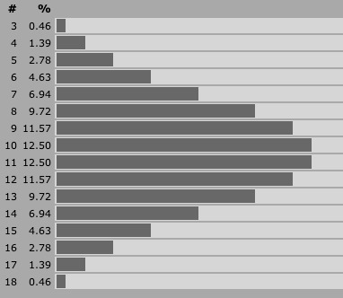
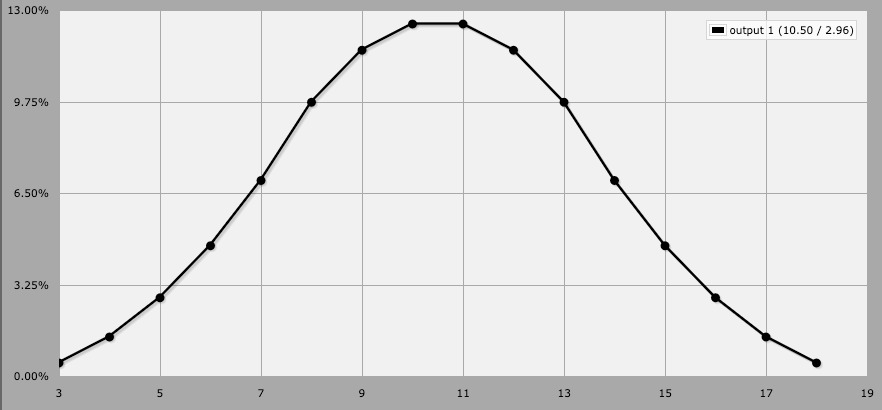

Dice and Die Rolls
------------------

3d6
~~~

Instead of a d20, roll 3d6 (roll three six-sided dice and add the results together). This changes the uniform distribution of the d20 into a bell-curve distribution of results between 3 and 18.

------------

This means that is more likely to get a result in the middle of the range, which avoids the "swingyness" of the d20, for more expected results. Very low and very high outcomes are much more unlikely.

When a character has many positive modifiers, the results tend to be consistent towards the upper end, meaning more successes and less surprise fumbles.

.. _criticals:

Criticals
~~~~~~~~~

- A natural 1 (a result of a 1 in the die) is a **Critical Failure**. 
- A natural 20 (a result of a 20 in the die) is a **Critical Success**.

(Regardless of any positive or negative modifiers)

This means that there's always a 5% chance of succeeding and a 5% of failing in any roll, regardless of how many Bonuses & Maluses a character might have.

.. tip::
   
   For extra impact, you can have a **Critical** multiply the amount of Effect by 2. 
   
   For example, if the Difficulty is 15 and a player rolls a 20 (for a total of 23 because of their modifiers), the regular *Positive Effect* of that roll would've been 8, but with this rule it would be duplicated, up to a 16!  

   The same can be applied to Critical Failures (the *Negative Effect* is duplicated).