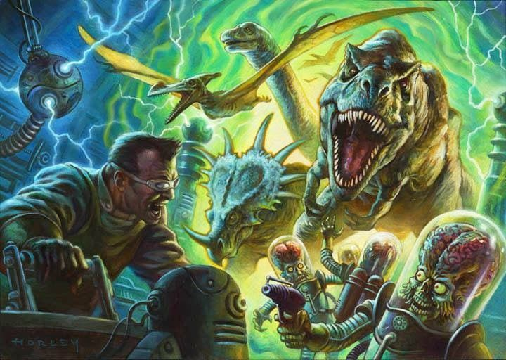

Principles
==========

What's expected of both Players and GM to play Erzählspiel as intended.

Player Principles
-----------------

.. image:: ../_static/images/rpg-image-6.jpg
   :align: center

**Be proactive; seek to fulfill objectives on your own.**
Don’t wait for the GM to give you a mission or a “call to
adventure”; you can come up with something on your
own. Think of what your character wants, or if they are
okay with the current situation around them. Try to act
proactively; think of how to change things to better suit
their needs.

**Roleplay your character from their personality,
desires, needs and flaws.** That is what “role-playing”
is about: putting yourself in the shoes of someone else.
Think of your character: What do they want? What do
they need? How do they usually act in order to get closer
to those objectives or ideals? And also, what are their
traits that might get them in trouble, or that they should
grow out of, over time?

**Don’t hog the spotlight; share it with the other
players.** In any good story, “character screen time”
should be somewhat balanced. Each of the player
characters are protagonists in this game, so make an
effort to leave space for others to participate in the
fiction as well. Sometimes your character might be the
star of a scene, and other times they might provide
support for another one to shine.

**Prod at the world, ask questions, be a fan of the
game.** Try to picture every scene in your head. Ask the
GM for more details about something that might not be
too clear. Inquire about the background of something
you stumble upon: maybe your character knows about it.
Maybe they don’t, which might pose a mystery. Before
acting, don’t hesitate to ask follow-up questions to
understand more about the situation and be on the same
page as the GM and the other players.

**Trust in the GM, embrace any curve-balls and say
“yes, and...”.** This is a “high-trust game” in which the
GM has their own Principles to follow. Their objective is
to be sincere and impartial, so if they throw something
at you that seems unfair, consider that they might be
doing it to make a more interesting narrative or a more
dramatic obstacle. Try to accept these challenges as part
of the game, focusing on how to solve them as a group.

**Separate player knowledge from character knowledge.** 
As a player, you have a birds-eye view of the
fiction. Some groups act more like a “writer’s room”,
thinking of how to inject more drama into scenes, even
though that might go against the needs or desires of their
characters. Other groups prefer to put themselves into
“first person” from the senses of their characters, and let
the GM infuse adversity and conflict. Both methods are
fine, but you should separate what you know and want,
from what your character knows and wants. Roleplay
your character from their point of view, even when
you, as the player, know what they are doing could be
detrimental to their plans.

Game Master Principles
----------------------

**Play worlds, not rules.** Game mechanics should never
prevail over in-world logic or genre tropes. Don’t
get hang up in new rulings or systems to simulate
unnecessary things; just follow the internal logic of the
world, and your gut, using the basic rules provided by
this game.

**Either failure/partial/success should move the story
forward.** Don’t fall into the trap of “nothing happens”
after a roll. Make it count. Make it change the state of
the narrative one way or another. If necessary, wrap
many actions into a single roll, to give it more gravitas.
Be a fan of the characters, but be fair and impartial.
As the GM, you should want to see the characters do
cool stuff and get out of trouble as any other spectator,
but it is also your job to be the judge. Be impartial and
don’t hesitate to increase difficulty often. Let them
deal with it. It is okay if they fail from time to time; we
also want to see our heroes fall and then get back up.
The GM plays as “the world”, and it should be neutral
towards the characters.

**Sometimes, disclaim decision making.** Every now
and then the GM can ask the players to come up with
background information or to describe something of the
world. Perhaps the GM wants to guide their answers
with leading questions, aiming for a specific outcome
while leaving the description to their imagination, as a
collaborative endeavor.

**Think offscreen too; the world keeps running in the
background.** Try to avoid having everything happening
around the characters only. Make things change when
they get back somewhere, don’t let them stay exactly the
same as when they left. Make their actions (or those of
other factions) impact the world and change it over time.
Make it feel alive.

**Impossible or Trivial actions don’t require rolls;
they just fail or succeed.** Specially if there is no
risk involved, the GM should just adjudicate what
happens. The same goes with extremely rare or outright
impossible attempts: don’t let a character roll, just
say it automatically fails. This could come into play
if a character accumulates too many beneficial or 
detrimental circumstances for a single action, making 
its result obvious.

**Always declare (or brainstorm) risks before rolling.**
You can ask the players what they think might happen in
case of failure. You don’t have to be too specific about
it, but you also shouldn’t blindside someone with a
bad outcome they weren’t expecting at all. Try to be as
transparent as possible; If you have to choose between
surprising them with a twist that might be a bitter pill
to swallow, or just telling them the requirements and
consequences, go for the latter.

**Conflict generates drama: put characters in the spot;
let them solve it.** No Conflict means no drama means
dull stories. Don’t hesitate to throw curve-balls to the
characters, put more obstacles in their path that they
were expecting, or make situations harder by increasing
the difficulty of their actions. 
Make them work for it, they’ll be happier when they
achieve something that feels their own win.

**Manage the spotlight; give everyone their time to
shine.** There is no initiative system, turns or rounds in
this game. The GM describes a situation and the players
say what their characters say or do. Your work here is
like that of a director; you want to give everyone their
time, moving from one to the other. If they split into
groups, you can leave one in a cliffhanger and go back to
the other. It takes practice but it is very rewarding when
it feels cohesive and no one needs to wait too long to act
or feels left out.

**Play to find out what happens: don’t plan ahead;
let them surprise you.** Roleplaying games work best
when the collective imagination of the whole group is
free to improvise. As a GM, you can prepare situations
or setpieces that might appear in the story, but you
shouldn’t try to force them in (let alone impose a whole
plot or structured story; those never work without
feeling “railroady” to players). It is best to have some
ideas beforehand without commiting too much to them.
“Draw maps, leave blanks” means you can prepare
places, background situations or states, but leaving
room for the characters to act and decide which way to
go or what course of action to take. You, as the GM, can
also be surprised with the outcome of the story, which
is oftentimes more fun than knowing every detail and
possibility.
